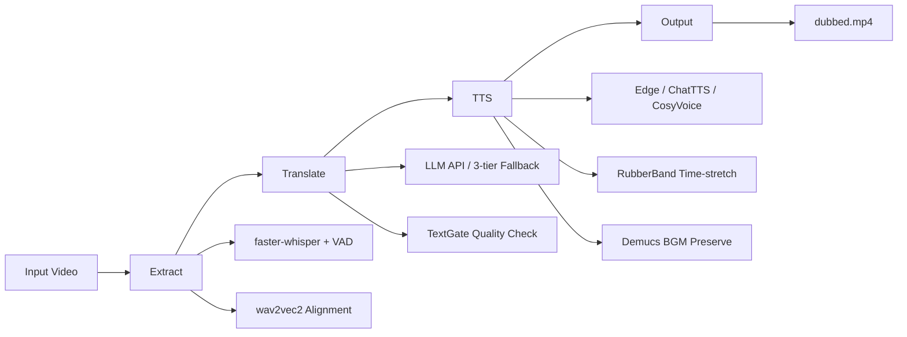
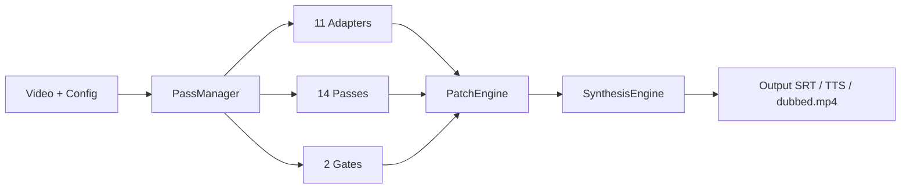
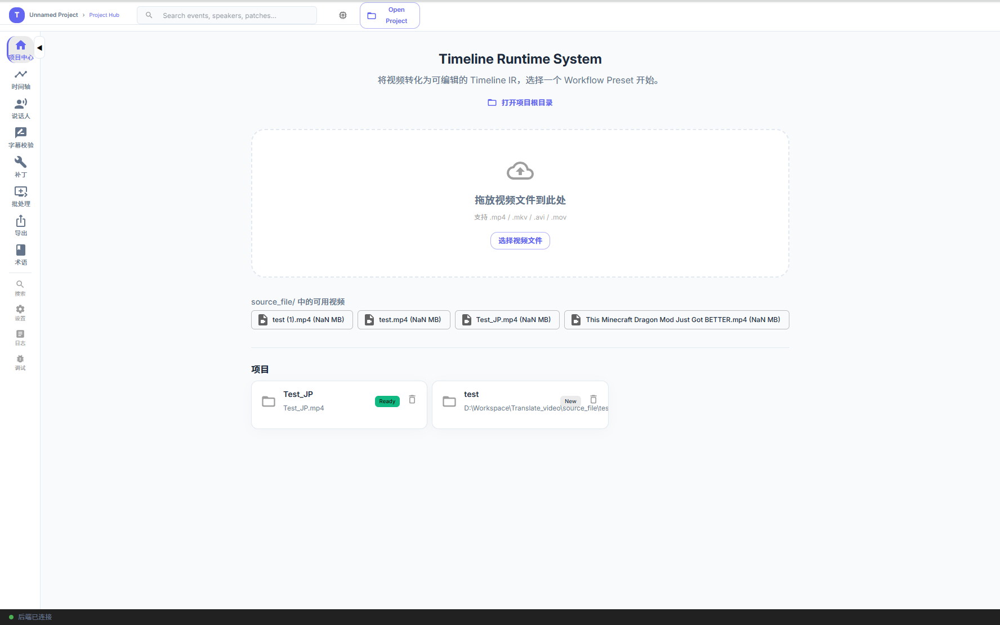
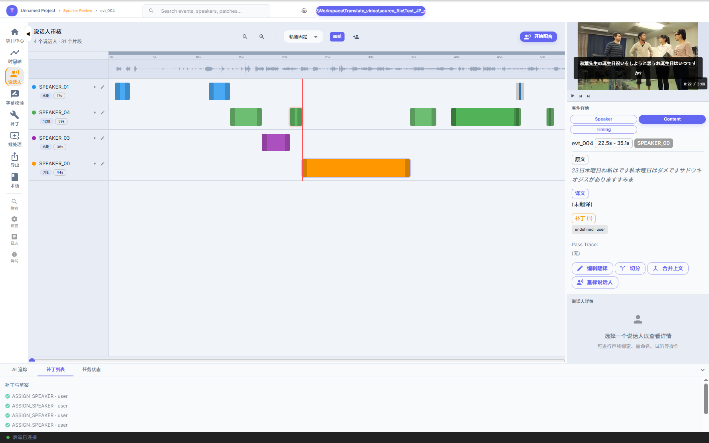
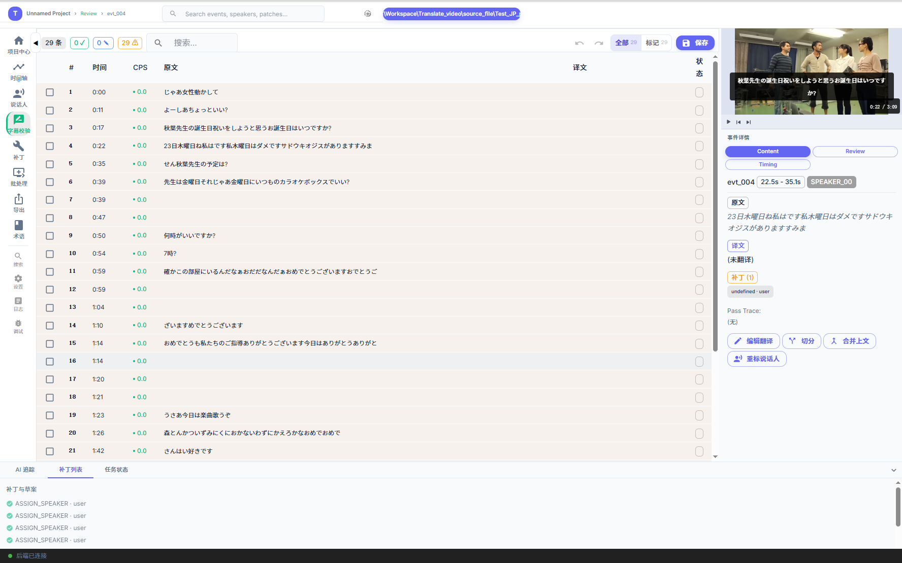
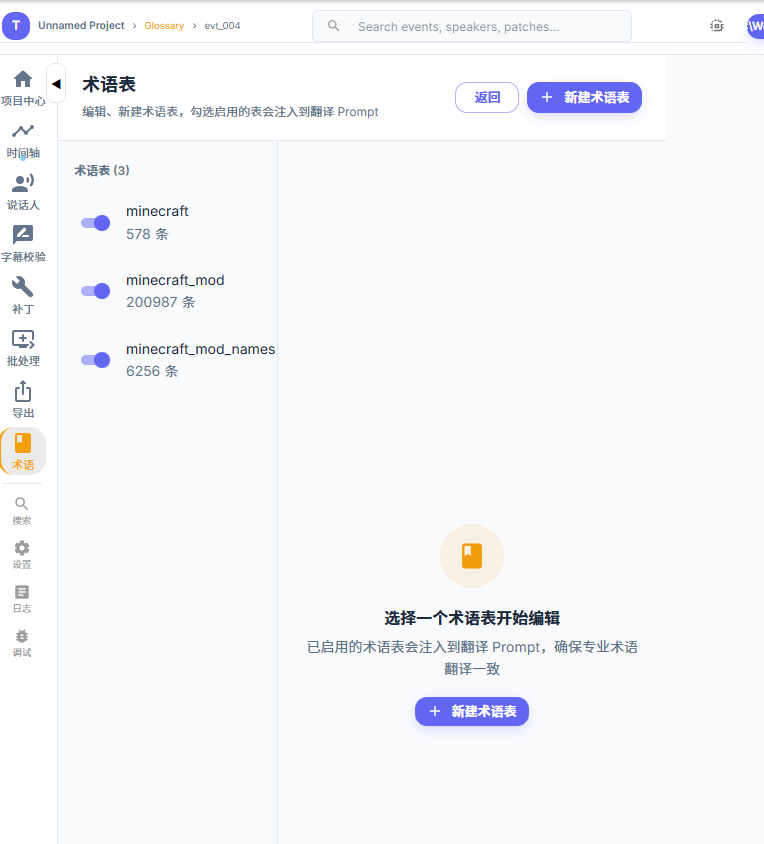
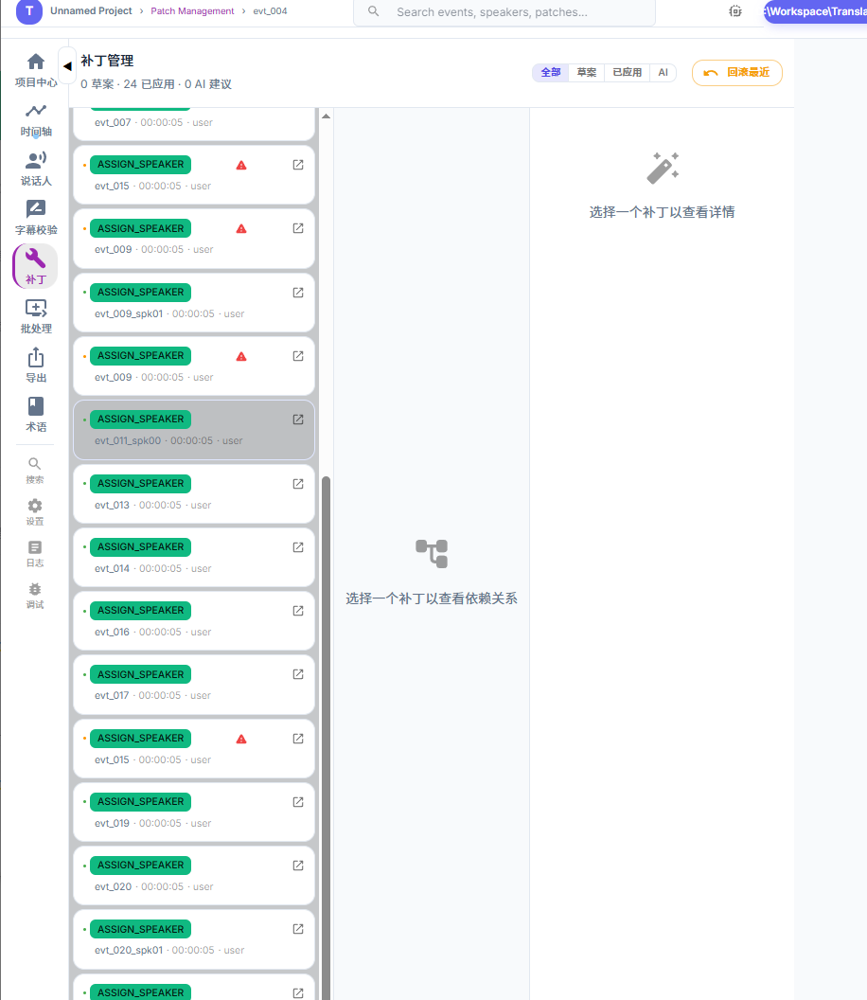

[English](README.md) | [简体中文](README_CN.md) | [WebUI](README_GUI.md)

<div align="center">


# Translate_video

**Video Subtitle Extraction → Translation → TTS Voice Synthesis — End-to-End Automated Pipeline**

[](https://github.com/Friend-Xu/Translate_video/stargazers)
[](LICENSE)
[](https://github.com/Friend-Xu/Translate_video/releases)

</div>

---

## What Is This

Drop in a video, get back a fully dubbed version: **extract subtitles → translate → TTS voiceover → output with bilingual captions**.

Perfect for video translation, multilingual dubbing, and subtitle production. Available as both CLI and WebUI.

---

## Quick Start

```bash
# 1. Setup
python -m venv .venv && .venv\Scripts\activate
pip install -r requirements.txt

# 2. Run pipeline
.venv\Scripts\python main.py source_file/test.mp4 --lang zh

# 3. Output
# → source_file/test_project/04_output/dubbed.mp4
```

Models download automatically to `models/` on first run.

> **Requirements:** Python 3.10+ | ffmpeg (bundled `imageio_ffmpeg`) | NVIDIA GPU recommended (CUDA, 4GB+ VRAM)

---

## What's New in v2.0.0

- **core/ Adapter-Pass-Gate Architecture** — 3-tier engine: 14 Pass + 11 Adapter + 8 Scorer + 2 Gate, type-safe composable pipeline
- **Timeline IR v2** — 9-slot event state + OpCode enum + version system, immutable data model
- **Patch Engine (Ch12)** — Full OpCode dispatch (merge/split/annotate), conflict detection, recompute engine, rollback & snapshot
- **Translation Quality Gate (Ch14)** — TextGate A/C/B triage + joint formula, TranslationScorer 5-dim weighted, MiniLM + PPL adapters
- **Emotion Control Axis (Ch15)** — Audio+text dual-path emotion recognition, EmotionGate E1/E2/E3, VAD-space emotion vectors
- **Unified Timeline Workbench** — React 19 + MUI 7 + Zustand, 5-mode WebUI (Import/Review/Speaker/Patch/Export), TimelineArena with rubber-band select, waveform, multi-track

---
## Features

| Feature | Description |
|------|------|
| 🎙️ **Whisper Extraction** | faster-whisper (CTranslate2) + Silero VAD + wav2vec2 alignment, ~20ms precision |
| 🌐 **Smart Translation** | Multi-LLM (DeepSeek/OpenAI), 15 target languages, on-demand glossary injection, 3-tier fallback |
| 🗣️ **TTS Synthesis** | Edge TTS / ChatTTS / CosyVoice triple engine, auto voice selection by target language, adaptive speed |
| 🎤 **CosyVoice TTS** | Offline zero-shot voice cloning TTS, subprocess isolation (no PyTorch conflicts), v2/v3 dual versions, auto number normalization |
| 🎼 **Rubber Band Stretch** | Industrial-grade time-stretching, natural-sounding ChatTTS speed adjustment |
| 🎵 **BGM Preservation** | Demucs vocal/instrumental separation, retains background music with loudness compensation |
| 🖥️ **WebUI Panel** | React + FastAPI, single video + batch mode, SSE real-time logs, virtual scrolling, connection status |
| 📝 **Subtitle Review** | Visual calibration panel, manual translation editing + save |
| 🔤 **Text Normalization** | WeTextProcessing Chinese TN (numbers/dates/percentages), whisperX artifact auto-fix |
| ⚡ **GPU Accelerated** | CUDA + float16 default, ChatTTS VRAM-aware model pool auto-sizing |
| 🔄 **Checkpoint Resume** | Interruption recovery, automatic re-run on source video change |
| 🧹 **Memory Cleanup** | Auto-release GPU/CPU memory after pipeline (>10GB freed) |

## Why Translate_video

**Compared to other video translation tools:**

| Capability | Translate_video | Others |
|------|:--:|:--:|
| Offline TTS (ChatTTS / CosyVoice) | ✅ VRAM-adaptive + zero-shot | ❌ Cloud API only |
| Auto language → voice | ✅ 15 languages | ⚠️ Manual |
| Audio time-stretching | ✅ Rubber Band | ❌ None / crude speed change |
| Glossary on-demand | ✅ Hit terms only | ❌ All terms injected (token waste) |
| GPU memory management | ✅ Auto release | ❌ Leaked VRAM |
| WebUI | ✅ Full visual panel | ⚠️ CLI only |

**Key advantages:**
- 🆓 **Offline Ready** — ChatTTS & CosyVoice run locally, no cloud TTS API dependency
- 🎯 **Precise Alignment** — wav2vec2 word-level timestamps + Rubber Band stretching, perfectly synced
- 🌍 **Multilingual** — Auto source detection + one-click target switch, voice & translation linked
- 🧠 **Smart Translation** — On-demand glossary (saves 90% tokens), optional Split-Brain / Multi-Agent
- 💪 **Production Ready** — Checkpoint resume + memory management + error recovery

---

## Architecture

**Production pipeline** (`main.py`):



**New core/ engine** (`main.py --use-core`):



Full architecture → [`ARCHITECTURE.md`](ARCHITECTURE.md)

---

## CLI Reference

### Full Pipeline

```bash
# GPU default (turbo + CUDA + float16)
.venv\Scripts\python main.py source_file/test.mp4 --lang zh

# Skip Demucs (faster for clean audio)
.venv\Scripts\python main.py source_file/test.mp4 --lang en --skip-demucs

# CPU fallback
.venv\Scripts\python main.py source_file/test.mp4 --device cpu --compute-type int8
```

### Extract Only

```bash
.venv\Scripts\python main.py source_file/test.mp4 --lang zh --skip-translate --skip-tts
.venv\Scripts\python main.py source_file/test.mp4 --lang zh --skip-translate --skip-tts --num-workers 2
```

### Translate Only (core 新引擎, 需已提取的工作区)

```bash
.venv\Scripts\python main.py source_file/test.mp4 --skip-tts
```

### VAD Benchmark

```bash
.venv\Scripts\python tests/benchmark_vad.py source_file/video.mp4 --quick
```

### CLI Arguments

| Argument | Default | Description |
|------|--------|------|
| `--lang` | auto | Source language (`zh`/`en`/`ja`), enables wav2vec2 alignment |
| `--model` | turbo | Whisper model (`tiny`/`base`/`small`/`medium`/`turbo`/`large-v3`) |
| `--device` | cuda | Compute device (`cuda`/`cpu`) |
| `--compute-type` | float16 | Precision (`float16`/`int8_float16`/`int8`/`float32`) |
| `--engine` | edge | TTS engine (`edge`/`chattts`/`cosyvoice`) |
| `--cosyvoice-tts-model-version` | v2 | CosyVoice model version (`v2`/`v3`) |
| `--cosyvoice-tts-lang` | — | Target language for TTS (`zh`/`en`/`ja`/`ko`/`yue`) |
| `--cosyvoice-tts-mode` | cross_lingual | Synthesis mode (fixed `cross_lingual`) |
| `--num-workers` | 1 | Whisper concurrency (2~4 for more VRAM) |
| `--skip-extract` / `--skip-translate` / `--skip-tts` | — | Skip steps |
| `--skip-demucs` | — | Skip vocal separation |
| `--force` | — | Force re-run all steps |
| `--caption-font` | — | Subtitle font path |
| `--caption-font-size` | 0 | Font size (0=auto-fit) |
| `--caption-font-color` | #ffffff | Font color |
| `--caption-position` | bottom | Position (`bottom`/`top`) |
| `--caption-max-lines` | 2 | Max subtitle lines |
| `--export-external-srt` | — | Export external subtitle file |
| `--use-core` | — | Use core/ Adapter-Pass-Gate pipeline (new architecture) |

---

## WebUI

```bash
# One-click
GUI\start_WebUI.bat

# Or manually: backend (port 8000)
.venv\Scripts\python -m uvicorn GUI.server:app --host 127.0.0.1 --port 8000

# Frontend dev (port 5173, proxies /api → 8000)
cd GUI && npm run dev
```

Visit `http://localhost:5173`.

**WebUI Screenshots:**



*Project Center — create / open / manage video workspaces*



*Speaker Review — per-speaker segments with voice profile and re-review*



*Subtitle Review — proofread translations, mark entries, re-run TTS*



*Glossary — term dictionary management*



*Patch — timeline edits & AI suggestions as patch list*

**WebUI Panels:**

| Panel | Purpose |
|------|------|
| **Main** | Drag-drop video → one-click process, SSE live logs |
| **Step Config** | 3-step visual config (Extract/Translate/TTS), GPU VRAM detection |
| **Output Settings** | Caption style (font/color/stroke/position), video encoder |
| **Subtitle Review** | Edit translations, mark issues, re-run TTS after save |
| **Tools** | Config import/export/reset, external subtitle optimizer, batch manager |

📖 **[Detailed WebUI Guide →](README_GUI.md)** (screenshots, features, FAQ)

<details>
<summary>WebUI Architecture</summary>

```
Browser (localhost:5173) → Vite dev server → proxy /api/* → uvicorn (localhost:8000)
                                                                  │
                                                          GUI/server.py (FastAPI)
                                                                  │
                                                          main.py (subprocess)
```

</details>

---

## Output Structure

Input `test.mp4` → outputs to `source_file/test_project/`:

```
test_project/
├── project.json            ← Stage progress tracking
├── 01_extract/             ← source.srt, transcript.json, audio.wav
├── 02_translate/           ← machine.srt, translate-log.json
├── 03_tts/                 ← TTS audio segments + video clips
└── 04_output/              ← dubbed.mp4 (final output)
```

---

## Configuration

### Translation (`config/translate.yaml`)

| Parameter | Default | Description |
|------|--------|------|
| `api_key` | — | API key (required, or use env var) |
| `api_type` | deepseek | API type (`deepseek`/`openai`) |
| `model` | deepseek-chat | Translation model |
| `source_lang` | auto | Source language (auto=detect) |
| `target_lang` | zh-CN | Target language (ja/en/ko/fr/de...) |
| `semantic_check` | true | Enable semantic verification |
| `semantic_threshold` | 0.65 | Similarity threshold |
| `terms_dict.enabled` | true | Enable on-demand glossary injection |
| `custom_prompt.enabled` | false | Enable custom translation prompt |
| `max_group_size` | 8 | Batch size per group |
| `concurrency.max_workers` | 8 | Translation concurrency |

### TTS (`config/tts.yaml`)

| Parameter | Default | Description |
|------|--------|------|
| `engine_type` | edge | TTS engine (`edge`/`chattts`/`cosyvoice`) |
| `cosyvoice_tts_model_version` | v2 | CosyVoice model (`v2`/`v3`) |
| `cosyvoice_tts_lang` | — | Target language (`zh`/`en`/`ja`/`ko`/`yue`) |
| `cosyvoice_tts_mode` | cross_lingual | Synthesis mode (cross_lingual verified best) |
| `voice` | zh-CN-XiaoxiaoNeural | Edge TTS voice (auto-overridden by target_lang) |
| `target_lang` | — | Target language, auto voice selection |
| `chattts_speaker_seed` | 2 | ChatTTS voice seed |
| `chattts_workers` | 0 | ChatTTS model replicas (0=VRAM auto) |
| `base_speed` | 40 | Base speech rate (+40%) |
| `max_speed` | 100 | Max speech rate (+100%) |
| `enable_caption` | true | Render captions on video |
| `enable_resume` | true | Checkpoint resume |

### Caption Style (`config/caption.yaml`)

| Parameter | Default | Description |
|------|--------|------|
| `font_size` | 0 | Font size (0=auto-fit) |
| `font_size_factor` | 0.03 | Auto size ratio |
| `width_ratio` | 0.85 | Max caption width ratio |
| `font_color` | #ffffff | Font color |
| `stroke_width` | 1.5 | Outline width |
| `max_lines` | 2 | Max lines |
| `alignment` | center | Text alignment (`center`/`left`/`right`) |
| `position` | bottom | Position (`bottom`/`top`) |

---

## Project Structure

```
Translate_video/
├── main.py                  # CLI entry: 3 stages all via WorkflowOrchestrator
├── tvw.py                   # Unified CLI + WebUI subprocess channel (core pipeline)
├── core/                    # Orchestration layer
│   ├── engine/              # WorkflowOrchestrator + PassManager + pass_factory
│   ├── ir/                  # Timeline IR v2 (frozen dataclasses)
│   ├── adapters/            # External engine wrappers (whisper/wav2vec2/pyannote/tts…)
│   ├── passes/              # Orchestration passes (LOAD/EXTRACT/TRANSLATE/TTS/EXPORT)
│   ├── gates/               # Quality gates (TextGate, EmotionGate)
│   ├── scoring/             # Engine scorers
│   ├── runtime/             # PatchEngine + timeline_io (唯一写路径)
│   ├── config/              # GlobalConfig + slot defaults + workflow policy
│   ├── quality/             # Quality strategies (xCOMET-lite / logic_gate)
│   ├── compat/              # cli_bridge (CLI 参数 → 槽位单一映射)
│   └── suggestion/          # AI 建议 (待迁移, 见 timeline/)
├── timeline/                # AI 建议只读链 (待退役 → core/suggestion)
│   ├── api/timeline.py      # generate_candidate_patches (唯一消费者 GUI/server.py)
│   ├── rules/ scorer/ patch/ # signal→score→plan
├── pipeline/                # Execution layer (被 core adapters 薄包装)
│   ├── video_info.py        # Video metadata
│   ├── gpu_detect.py        # GPU/encoder auto-detection
│   ├── demucs_instr.py      # Demucs vocal/BGM separation
│   ├── tts_*.py             # TTS engine/timing/video/caption/pipeline
│   ├── audio_stretch.py     # Rubber Band time-stretching
│   ├── subtitle_optimizer.py
│   └── utils.py
├── SRT/                     # Execution layer (被 core adapters 包装)
│   ├── MediaValidator.py    # C2 defect detect + aresample fix
│   ├── TranslationVerifier.py # cross-lingual similarity
│   └── VAD_Segmenter.py     # Silero VAD
├── whisperx_local/          # wav2vec2 forced alignment
├── GUI/                     # React WebUI
│   ├── server.py            # FastAPI backend
│   ├── App.tsx              # React root
│   └── start_WebUI.bat      # One-click launcher
├── config/                  # YAML configs
├── tests/                   # Tests + benchmarks
└── models/                  # Model cache (gitignored)
```

---

## Running Tests

```bash
# All TTS tests
.venv\Scripts\python -m pytest tests/test_tts/ -v

# Single test
.venv\Scripts\python -m pytest tests/test_tts/test_tts_edge.py -v

# VAD benchmark (ONNX vs JIT)
.venv\Scripts\python tests/benchmark_vad.py source_file/video.mp4 --quick
```

---

## Contributing

1. Fork → create branch → PR
2. Run `pytest tests/` before submitting
3. Follow existing code style

---

## License

[Apache License 2.0](LICENSE)

---

<div align="center">

[](https://star-history.com/#Friend-Xu/Translate_video&Date)

</div>
