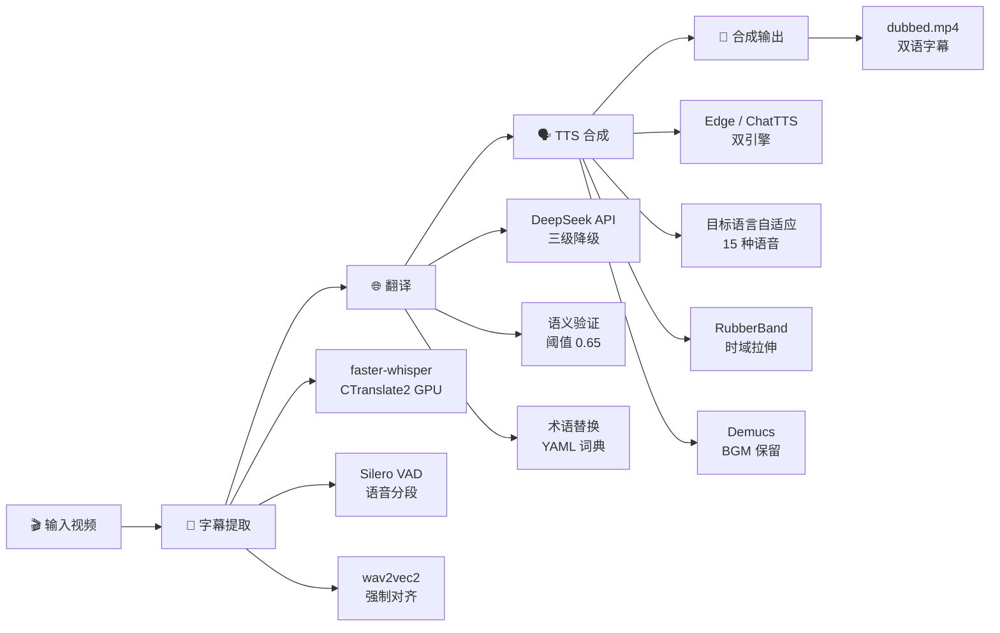

[English](README.md) | 简体中文

<div align="center">


# Translate_video

**视频字幕提取 → 翻译 → TTS 语音合成 — 端到端自动化流水线**

[](https://github.com/Friend-Xu/Translate_video/stargazers)
[](LICENSE)
[](https://github.com/Friend-Xu/Translate_video/releases)

</div>

---

## 这是什么

输入一个视频，自动完成：**提取字幕 → 翻译目标语言 → TTS 合成配音 → 输出带双语字幕的配音视频**。

适用于视频翻译、多语言配音、字幕制作等场景。提供 CLI 命令行和 WebUI 两种使用方式。

---

## 快速开始

```bash
# 1. 安装
python -m venv .venv && .venv\Scripts\activate
pip install -r requirements.txt

# 2. 运行流水线
.venv\Scripts\python main.py source_file/test.mp4 --lang ja

# 3. 查看输出
# → source_file/test_project/04_output/dubbed.mp4
```

模型首次运行时自动下载到 `models/` 目录，无需手动操作。

> **环境要求：** Python 3.10+ | ffmpeg（自动使用内置 `imageio_ffmpeg`）| 推荐 NVIDIA GPU（CUDA, 4GB+ VRAM）

---

## 功能亮点

| 功能 | 说明 |
|------|------|
| 🎙️ **Whisper 字幕提取** | faster-whisper (CTranslate2) + Silero VAD + wav2vec2 强制对齐，~20ms 精度 |
| 🌐 **智能翻译** | 多 LLM 支持（DeepSeek/OpenAI），15 种目标语言，术语表按需注入，三级降级策略 |
| 🗣️ **TTS 语音合成** | Edge TTS / ChatTTS 双引擎，目标语言自动匹配语音，自适应语速调节 |
| 🎼 **Rubber Band 音频拉伸** | 工业级时域拉伸，ChatTTS 无感加速，保持音色自然不失真 |
| 🎵 **背景音乐保留** | Demucs 人声/伴奏分离，保留 BGM + 响度补偿到原始水平 |
| 🖥️ **WebUI 界面** | React + FastAPI，单视频 + 批处理模式，SSE 实时日志 |
| 📝 **字幕校准** | 可视化字幕审核面板，手动修正翻译 + 保存修改 |
| ⚡ **GPU 加速** | CUDA + float16 默认，ChatTTS VRAM 感知自动调节模型池大小 |
| 🔄 **断点续传** | Checkpoint 机制，中断后可恢复，源视频变更自动检测重跑 |
| 🧹 **内存管理** | 流水线完成后自动释放 GPU/CPU 内存（10GB+），不残留显存占用 |

## 为什么选择 Translate_video

**对比其他视频翻译方案：**

| 能力 | Translate_video | 其他工具 |
|------|:--:|:--:|
| 离线 TTS（ChatTTS） | ✅ VRAM 自适应 | ❌ 仅云端 API |
| 目标语言自动适配 | ✅ 15 种语言自动选语音 | ⚠️ 手动指定 |
| 音频时域拉伸 | ✅ Rubber Band 工业级 | ❌ 无/暴力变速 |
| 术语表按需注入 | ✅ 只传命中术语 | ❌ 全量注入浪费 token |
| GPU 内存管理 | ✅ 自动释放回收 | ❌ 残留占用 |
| WebUI 面板 | ✅ 完整可视化 | ⚠️ 仅 CLI |

**核心优势：**
- 🆓 **离线可用** — ChatTTS 本地运行，不依赖云端 TTS API
- 🎯 **精确对齐** — wav2vec2 词级时间戳 + Rubber Band 时域拉伸，字幕语音同步
- 🌍 **多语言就绪** — 源语言自动检测 + 目标语言一键切换，语音/翻译全链路联动
- 🧠 **智能翻译** — 术语按需注入（节省 90% token），Split-Brain / Multi-Agent 可选增强
- 💪 **生产就绪** — 断点续传 + 内存管理 + 错误兜底，长时间运行不崩溃

---

## 架构



详细架构 → [`ARCHITECTURE.md`](ARCHITECTURE.md)

---

## CLI 命令参考

### 完整流水线

```bash
# GPU 默认（turbo + CUDA + float16）
.venv\Scripts\python main.py source_file/test.mp4 --lang ja

# 跳过 Demucs 人声分离（干净音频更快）
.venv\Scripts\python main.py source_file/test.mp4 --lang en --skip-demucs

# CPU 回退
.venv\Scripts\python main.py source_file/test.mp4 --device cpu --compute-type int8
```

### 仅字幕提取

```bash
.venv\Scripts\python extract_subtitles.py source_file/test.mp4 --lang ja
.venv\Scripts\python extract_subtitles.py source_file/test.mp4 --lang ja --num-workers 2  # 并发加速
```

### 仅翻译

```bash
.venv\Scripts\python -m SRT.SRT_Translator path/to/file.srt
```

### VAD 性能测试

```bash
.venv\Scripts\python tests/benchmark_vad.py source_file/video.mp4 --quick
```

### 命令行参数

| 参数 | 默认值 | 说明 |
|------|--------|------|
| `--lang` | 自动检测 | 源语言 (`en`/`ja`/`zh`)，指定后启用 wav2vec2 对齐 |
| `--model` | turbo | whisper 模型 (`tiny`/`base`/`small`/`medium`/`turbo`/`large-v3`) |
| `--device` | cuda | 计算设备 (`cuda`/`cpu`) |
| `--compute-type` | float16 | 计算精度 (`float16`/`int8_float16`/`int8`/`float32`) |
| `--engine` | edge | TTS 引擎 (`edge`/`chattts`) |
| `--num-workers` | 1 | whisper 并发数 (2~4 需充足 VRAM) |
| `--skip-extract` / `--skip-translate` / `--skip-tts` | — | 跳过指定步骤 |
| `--skip-demucs` | — | 跳过人声分离 |
| `--skip-defect-check` | — | 跳过 C2 缺陷检测 |
| `--force` | — | 强制重新执行全部步骤 |
| `--backup-dir` | — | 每步自动备份到指定目录 |
| `--caption-font` | — | 字幕字体路径 |
| `--caption-font-size` | 0 | 字号 (0=自适应视频尺寸) |
| `--caption-font-color` | #ffffff | 字体颜色 |
| `--caption-position` | bottom | 字幕位置 (`bottom`/`top`) |
| `--caption-max-lines` | 2 | 最大行数 |
| `--no-optimize-subtitles` | — | 禁用字幕优化 |
| `--export-external-srt` | — | 输出外挂字幕版本 |

---

## WebUI

```bash
# 一键启动
GUI\start_WebUI.bat

# 或手动：后端（端口 8000）
.venv\Scripts\python -m uvicorn GUI.server:app --host 127.0.0.1 --port 8000

# 前端开发模式（端口 5173，代理 /api → 8000）
cd GUI && npm run dev
```

启动后访问 `http://localhost:5173`。

**WebUI 功能面板：**

| 面板 | 功能 |
|------|------|
| **主界面** | 拖拽视频 → 一键处理，SSE 实时日志，完成/运行状态切换 |
| **步骤配置** | 三步可视化配置（提取/翻译/TTS），GPU VRAM 自动检测 |
| **输出设置** | 字幕样式（字体/颜色/描边/位置）、视频编码参数 |
| **字幕校准** | 审核/编辑翻译结果、标记问题条目、保存后重新 TTS |
| **工具栏** | 配置导入/导出/重置、外挂字幕优化器、批量文件管理 |

📖 **[详细 WebUI 使用指南 →](README_GUI_CN.md)**（含截图、功能详解、常见问题）

<details>
<summary>点击展开：WebUI 架构</summary>

```
Browser (localhost:5173) → Vite dev server → proxy /api/* → uvicorn (localhost:8000)
                                                                  │
                                                          GUI/server.py (FastAPI)
                                                                  │
                                                          main.py (subprocess)
```

</details>

---

## 输出结构

输入 `test.mp4` → 输出到 `source_file/test_project/`：

```
test_project/
├── project.json            ← 阶段进度追踪
├── 01_extract/             ← source.srt, transcript.json, audio.wav
├── 02_translate/           ← machine.srt, translate-log.json
├── 03_tts/                 ← TTS 音频片段 + 视频片段
└── 04_output/              ← dubbed.mp4（最终输出）
```

---

## 配置

### 翻译配置 (`config/translate.yaml`)

| 参数 | 默认值 | 说明 |
|------|--------|------|
| `api_key` | — | API Key（必填，也可设环境变量） |
| `api_type` | deepseek | API 类型 (`deepseek`/`openai`) |
| `model` | deepseek-chat | 翻译模型 |
| `source_lang` | auto | 源语言（auto=自动检测） |
| `target_lang` | zh-CN | 目标语言（ja/en/ko/fr/de...） |
| `semantic_check` | true | 启用语义相似度核对 |
| `semantic_threshold` | 0.65 | 语义相似度阈值 |
| `terms_dict.enabled` | true | 启用术语表按需注入 |
| `custom_prompt.enabled` | false | 启用自定义翻译 Prompt |
| `max_group_size` | 8 | 批翻译每组最大条数 |
| `concurrency.max_workers` | 8 | 翻译并发数 |

### TTS 配置 (`config/tts.yaml`)

| 参数 | 默认值 | 说明 |
|------|--------|------|
| `engine_type` | edge | TTS 引擎 (`edge`/`chattts`) |
| `voice` | zh-CN-XiaoxiaoNeural | Edge TTS 发音人（target_lang 自动覆盖） |
| `target_lang` | — | 目标语言，自动匹配语音 |
| `chattts_speaker_seed` | 2 | ChatTTS 音色种子 |
| `chattts_workers` | 0 | ChatTTS 模型副本数 (0=VRAM 自动) |
| `base_speed` | 40 | TTS 基础语速 (+40%) |
| `max_speed` | 100 | TTS 最大语速 (+100%) |
| `enable_caption` | true | 渲染字幕到视频 |
| `enable_resume` | true | 断点续传 |

### 字幕样式 (`config/caption.yaml`)

| 参数 | 默认值 | 说明 |
|------|--------|------|
| `font_size` | 0 | 字号 (0=自适应) |
| `font_size_factor` | 0.03 | 自适应比例因子 |
| `width_ratio` | 0.85 | 字幕最大宽度比 |
| `font_color` | #ffffff | 字体颜色 |
| `stroke_width` | 1.5 | 描边宽度 |
| `max_lines` | 2 | 最大行数 |
| `alignment` | center | 对齐方式 (`center`/`left`/`right`) |
| `position` | bottom | 位置 (`bottom`/`top`) |

---

## 模块结构

```
Translate_video/
├── main.py                  # 推荐入口：3 步流水线
├── extract_subtitles.py     # 字幕提取入口（独立运行）
├── pipeline/                # 核心模块
│   ├── audio.py             # 音频提取 + C2 缺陷修复
│   ├── transcriber.py       # Silero VAD + faster-whisper + wav2vec2 对齐
│   ├── video_info.py        # 视频元数据
│   ├── gpu_detect.py        # GPU/编码器自动检测
│   ├── demucs_instr.py      # Demucs 人声/背景分离
│   ├── tts_*.py             # TTS 引擎/时序/视频/字幕/编排/续传
│   ├── subtitle_optimizer.py # 字幕质量优化
│   └── utils.py             # 通用工具
├── SRT/                     # 字幕处理
│   ├── SRT_Translator.py    # DeepSeek 翻译（三级降级）
│   ├── TranslationVerifier.py # 跨语言语义核对
│   ├── TermReplacer.py      # 术语词典替换
│   └── VAD_Segmenter.py     # Silero VAD (ONNX ~9x 加速)
├── whisperx_local/          # wav2vec2 强制对齐
├── GUI/                     # React WebUI
│   ├── server.py            # FastAPI 后端
│   ├── App.tsx              # React 根组件
│   └── start_WebUI.bat      # 一键启动
├── config/                  # YAML 配置文件
├── tests/                   # 测试 + 基准
└── models/                  # 模型缓存（gitignored）
```

---

## 运行测试

```bash
# 全部 TTS 测试
.venv\Scripts\python -m pytest tests/test_tts/ -v

# 单个测试
.venv\Scripts\python -m pytest tests/test_tts/test_tts_edge.py -v

# VAD 基准（ONNX vs JIT）
.venv\Scripts\python tests/benchmark_vad.py source_file/video.mp4 --quick
```

---

## 贡献

1. Fork → 创建分支 → PR
2. 提交前运行 `pytest tests/` 确保测试通过
3. 遵循项目现有代码风格

---

## 许可证

[MIT](LICENSE)

---

<div align="center">

[](https://star-history.com/#Friend-Xu/Translate_video&Date)

</div>
